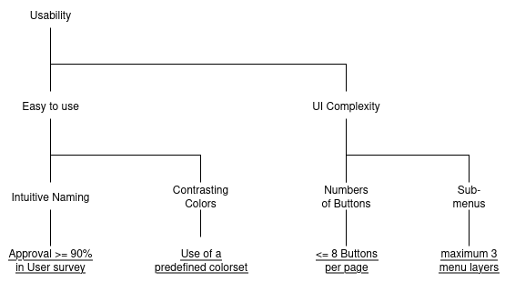
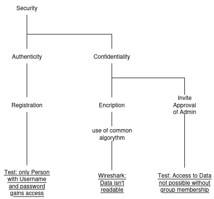
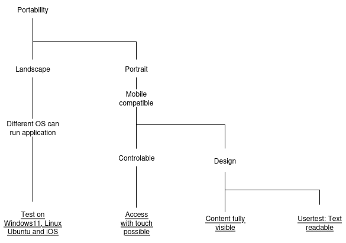
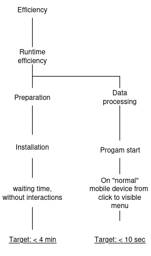
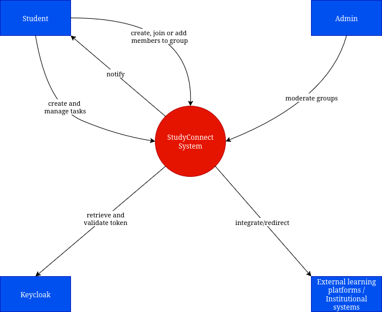
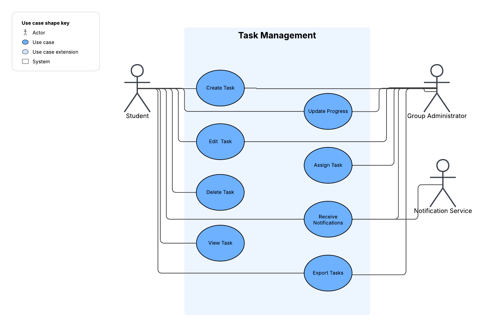

<p align="center"><b><font size="7">Dokumentation Studyconnect</font></b></p>
<p align="center"><b><font size="6">Gruppe 4</font></b></p>

### Architektur


<p align="center">
  <em>Strukturdiagramm</em>
</p>

<p align="center">
  Abbildung 1: Strukturdiagramm. <em>Erstellt mit <a href="https://draw.io">draw.io</a></em>
</p>


#### Angular (Frontend)

Angular bietet eine umfangreiche Sammlung integrierter Funktionalitäten wie Routing, Formularverarbeitung, HTTP-Client und State Management. Diese ermöglichen eine strukturierte und effiziente Entwicklung auch bei komplexen Anwendungen. Die klare Architektur sowie die strikte Trennung von Komponenten fördern sowohl die Wartbarkeit als auch die Skalierbarkeit des Systems.

Ein wesentlicher Vorteil liegt in der hohen Modularität: Durch wiederverwendbare Komponenten können dynamische Benutzeroberflächen einfacher und konsistenter entwickelt werden. Zusätzlich lässt sich Angular flexibel mit externen Bibliotheken und Abhängigkeiten erweitern, was den Funktionsumfang individuell anpassbar macht.

Angular wird aktiv von Google weiterentwickelt und als Open-Source-Projekt bereitgestellt. Dadurch profitieren Entwickler von einer kontinuierlichen Weiterentwicklung, einer umfangreichen Dokumentation und einer großen Community, die Hilfestellungen und Best Practices bereitstellt.

Ein weiterer Grund für die Wahl von Angular war die vorhandene Erfahrung im Team. Einige Mitglieder hatten bereits praktische Kenntnisse in Angular, was die Einarbeitungszeit deutlich reduziert.

##### Vorteile von TypeScript

Angular basiert auf TypeScript, einer von Microsoft entwickelten Erweiterung von JavaScript. TypeScript bietet statische Typisierung sowie moderne Sprachfeatures, die über den Standard von JavaScript hinausgehen. Dadurch wird eine höhere Codequalität erreicht, da viele Fehler bereits während der Entwicklungszeit erkannt werden. Das Debugging gestaltet sich dadurch effizienter, und die Wartung des Codes wird langfristig erleichtert.

TypeScript fördert zudem eine bessere Strukturierung von größeren Projekten. Dank Interfaces, Typdefinitionen und Klassenorientierung lassen sich komplexe Anwendungen übersichtlicher aufbauen und erweitern.

#### Spring Boot (Backend)

Für das Backend fiel die Wahl auf Spring Boot. Das Framework ermöglicht die schnelle und effiziente Entwicklung von REST-APIs, über die das Angular-Frontend mit den benötigten Daten versorgt wird.

Die Architektur von Spring Boot ist klar strukturiert und folgt dem Schichtenmodell:
- **Controller**: nimmt Anfragen entgegen und leitet sie weiter
- **Service**: enthält die zentrale Geschäftslogik
- **Repository**: kapselt den Zugriff auf die Datenbank

Diese Trennung fördert eine saubere Code-Struktur und erleichtert die Wartung sowie Erweiterbarkeit der Anwendung.

Spring Boot bietet zudem eine enge Integration mit Spring Data JPA, wodurch Datenbankzugriffe stark vereinfacht werden. Standard-CRUD-Operationen lassen sich ohne großen Implementierungsaufwand realisieren. Für komplexere Anforderungen können individuelle Methoden flexibel ergänzt werden.

Ein weiterer Vorteil liegt in der großen Community und dem breiten Ökosystem von Spring. Dadurch stehen zahlreiche Erweiterungen und Bibliotheken zur Verfügung, die den Entwicklungsprozess beschleunigen und gleichzeitig die Stabilität der Anwendung sicherstellen.

#### PostgreSQL (Datenbank)

PostgreSQL hat sich als führender Open-Source-Konkurrent zu einem weit verbreiteten relationalen Datenbankmanagementsystem (DBMS) etabliert.
Es bietet umfassende Funktionen wie die Unterstützung von JSON-Daten, Volltextsuche und benutzerdefinierten Datentypen. Zudem zeichnet es sich durch enorme Skalierbarkeit aus und ist sowohl für kleine als auch für sehr große Datenbanken geeignet.
Durch die hohe ACID-Konformität gewährleistet es eine ausgezeichnete Datenintegrität und Transaktionssicherheit, während die engagierte Community kontinuierlich neue Funktionen und Updates bereitstellt.

---

### Projektmanagment

Für das Projektmanagement setzen wir auf das **GitHub-Kanban-Board**, auf dem alle Aufgaben, Features und sonstigen Angelegenheiten als Issues erfasst werden. Teammitglieder weisen sich Issues selbständig zu.

Die Entwicklung erfolgt auf *Feature-Branches*, die jeweils einem bestimmten Issue zugeordnet sind. Sobald ein Feature fertiggestellt ist, wird der Branch in `main` gemerged. Dabei wird in der Commit- oder Merge-Nachricht das zugehörige Issue verlinkt, sodass automatisch nachvollziehbar ist, welches Issue dadurch abgeschlossen wurde.

Die sonstige Kommunikation im Team läuft über einen Discord-Server, auf dem Rückfragen, Abstimmungen und Diskussionen zu Aufgaben stattfinden. So bleibt die Zusammenarbeit strukturiert, und alle Teammitglieder können jederzeit den aktuellen Stand einsehen.

---

### Funktionale Anforderungen

- Benutzer können persönliche Aufgaben erstellen, bearbeiten, löschen und kategorisieren.
- Aufgaben können mit Titel, Frist, Priorität und Notizen versehen werden.
- Nutzer können parallel mehrere Lernziele verwalten und deren Fortschritt überblicken.
- Unterstützung individueller und Gruppen-Aufgabenverwaltung: persönliche Aufgaben planen und in kleinen Studiengruppen zusammenarbeiten.
- Nutzer können Gruppen erstellen, beitreten, Mitglieder einladen und Aufgaben zuweisen.
- Rollen- und Rechteverwaltung zur Unterscheidung von Mitgliedern und Administratoren mit klarer Aufgabenverteilung und Gruppenmoderation.
- Aufgabenbezogene Kommunikation: Kommentarfunktionen und Messaging zur engen Verzahnung von Diskussion und Arbeit.
- Aufgaben und Gruppenaktivitäten sind an bestimmte Termine gebunden mit Hervorhebung von anstehenden und überfälligen Fristen.
- Unterstützende, nicht aufdringliche Erinnerungen und Benachrichtigungen.
- Export von Aufgabenplänen und Zeitplänen als PDF oder Kalenderdatei (ICS).
- Zugriff und Nutzung über Webbrowser auf verschiedenen Endgeräten (PC, Tablet, Smartphone) sowie mobile Nutzung.
- Fortschrittsstatus für Aufgaben (offen, in Bearbeitung, erledigt) zur Unterstützung von Priorisierung und Zeitmanagement.
- Gamification-Elemente wie Fortschrittspunkte oder Abzeichen zur Motivation, ohne vom Lernziel abzulenken.

### Nicht-funktionale Anforderungen

- **Simplicity and Usability:** Intuitive, logische Benutzeroberfläche, die schnelle, einfache Bedienung ohne Schulungsbedarf ermöglicht.
- **Accessibility:** Plattformübergreifende Zugänglichkeit auf Web, Mobile und potenziell Desktop, inklusive Barrierefreiheit.
- **Reliability:** Hohe Verfügbarkeit und Stabilität, mit Fehlertoleranz und Verlässlichkeit im Betrieb.
- **Maintainability:** Modularer Designansatz für erweiterbare und wartbare Architektur.
- **Performance:** Schnelle Ladezeiten und reaktionsfähige Bedienung, auch bei höheren Benutzerzahlen.
- **Security:** Schutz der Nutzerdaten sowie sichere Authentifizierung und Zugriffskontrolle.
- **Testability:** Klare Modulgrenzen und Schnittstellen zur einfachen Testdurchführung.
- **Portability:** Plattformübergreifende Nutzbarkeit sowie leichte Integration in bestehende Lern-Workflows durch Exportisierung.
- **Integration:** Unterstützung zukünftiger Integration mit externen Lernplattformen und institutionellen Systemen.

### Quality Model

#### 4 major Quality aspects

- Usability


<p align="center">
  <em>Usability quality model</em>
</p>

- Security


<p align="center">
  <em>Security quality model</em>
</p>

- Portability


<p align="center">
  <em>Portability quality model</em>
</p>

- Efficiency


<p align="center">
  <em>Efficiency quality model</em>
</p>


#### Quality aspect of testability

- Tests von Anfang an mit in den Code einbringen.
- Kritische Funktionen auf Testbarkeit prüfen und für bessere Testbarkeit modifizieren falls möglich.
- Lauffähige Applikations-Versionen während der Entwicklung starten und testen.

---

### Systemkontext-Diagramm
Das Systemkontext-Diagramm stellt die wichtigsten Interaktionen zwischen dem StudyConnect-System und anderen Systemen oder Akteuren dar.


<p align="center">
  <em>Systemkontext-Diagramm</em>
</p>

---

### Use-Case-Diagramm
Basierend auf der Funktion "Task Management" wird folgendes Use-Case Diagramm zur visuellen Veranschaulichung dargestellt.


<p align="center">
  <em>Use-case-Diagramm</em>
</p>

Die Use-Case Beschreibung für dieses Diagramm kann unter dem Ordner use-cases gefunden werden.

---

### Die Anwendung starten

#### Installation der erforderlichen Voraussetzungen für das Backend

Kurzübersicht — Was installiert werden sollte

- Java Development Kit (JDK) 21
- Apache Maven (alternativ: Maven Wrapper, siehe weiter unten)
- Docker CLI und Docker Compose (empfohlen, erleichtert das Aufsetzen einer lokalen Datenbank)

Hinweis: Statt Docker kann auch eine bestehende Datenbank verwendet werden, dann müssen jedoch manuelle Anpassungen an der Konfiguration vorgenommen werden (siehe Abschnitt „Alternative: eigene Datenbank verwenden“). Diese Option wird nicht empfohlen.

Schritte (high-level)

1. JDK 21 installieren

  - Installieren Sie ein Java Development Kit in der Version 21 (z. B. Temurin, OpenJDK, Azul). Stellen Sie sicher, dass es sich um ein JDK (nicht nur eine JRE) handelt.
  - Setzen Sie anschließend die Umgebungsvariable `JAVA_HOME` auf den Installationspfad und fügen Sie die `bin`-Unterordner zum `PATH` hinzu (Windows: Systemeigenschaften → Umgebungsvariablen)
  (Ubuntu: in /etc/profile oder als `.sh` file unter /etc/profile.d/ mit z.B. folgenden Befehlen einrichten:
   export JAVA_HOME=$(readlink -f /usr/bin/javac | sed "s:/bin/javac::")
   export PATH=$PATH:$JAVA_HOME/bin).

2. Apache Maven (oder Maven Wrapper)

  - Installieren Sie Apache Maven, oder verwenden Sie den im Projekt vorhandenen Maven Wrapper. Der Wrapper (`mvnw` / `mvnw.cmd`) erlaubt es, das Projekt zu bauen, ohne Maven systemweit zu installieren.

3. Docker (empfohlen)

  - Installieren Sie die Docker-CLI und Docker Compose (unter Windows typischerweise über Docker Desktop). Das ist empfohlen, da das Projekt eine PostgreSQL-Datenbank benötigt und Docker-Compose das lokale Starten einer Datenbank stark vereinfacht.

4. Projekt-Ordner und Build

  - Öffnen Sie eine Eingabeaufforderung oder PowerShell und wechseln Sie in das Verzeichnis `backend`, in dem sich die `pom.xml` befindet.
  - Führen Sie dort einen Build aus, z. B. mit dem Maven Wrapper oder Ihrer systemweiten Maven-Installation:

    - Auf Windows mit Wrapper: `mvnw.cmd install`
    - Auf Unix mit Wrapper: `./mvnw install`
    - Oder mit installiertem Maven: `mvn install`

Alternative: eigene Datenbank verwenden (nicht empfohlen)

- Falls Sie Docker nicht verwenden möchten, können Sie eine externe PostgreSQL-Datenbank zur Verfügung stellen. In diesem Fall müssen Sie die Datenbankverbindungsdaten (URL, Benutzername, Passwort) in der Anwendung konfigurieren.
- Passen Sie die `.env`-Datei im Ordner backend an, sowie gegebenenfalls die Datei(en) `src/main/resources/application.properties` (oder `application-dev.properties`), damit die Anwendung die richtige Datenbank erreicht. Achten Sie auf die korrekten JDBC-URL-Formate und auf die Übereinstimmung der verwendeten Ports.

#### Starten des Backends

Führen Sie die folgenden Schritte im Verzeichnis `backend` aus, nachdem Sie die Voraussetzungen installiert haben:

1. Kopieren Sie die Beispieldatei `.env.example` und legen Sie eine lokale `.env`-Datei an (diese enthält Umgebungsvariablen und kann bei Bedarf angepasst werden).

   - Beispiel (PowerShell):

     ```powershell
     Copy-Item .env.example .env
     ```

   - Beispiel (Unix / Bash):

     ```sh
     cp .env.example .env
     ```

2. Starten Sie die Anwendung mit Maven:

   - Mit installiertem Maven:

     ```sh
     mvn spring-boot:run
     ```

   - Oder mit dem Projekt-Maven-Wrapper (Windows):

     ```powershell
     .\mvnw.cmd spring-boot:run
     ```

Hinweis: Beim ersten Start lädt Maven die benötigten Abhängigkeiten herunter; falls Sie Docker verwenden, werden auch die benötigten Images gezogen. Der erste Start kann deshalb mehrere Minuten dauern. Warten Sie, bis in den Logs steht, dass die Anwendung erfolgreich gestartet wurde (z. B. eine Zeile mit "Started StudyconnectApplication").

Falls die Anwendung keine Verbindung zur Datenbank herstellen kann, prüfen Sie zunächst:

- Ob Docker Desktop (bei Verwendung von Docker) läuft und die DB-Container gestartet sind.
- Ob die Einstellungen in der `.env`-Datei und gegebenenfalls in `src/main/resources/application.properties` korrekt sind (JDBC-URL, Benutzer, Passwort, Ports).

---

#### Installation der erfoderlichen Voraussetzungen für das Frontend (Angular)
Eine Kurzliste der benötigten Werkzeuge und Schritte, um das Angular-Frontend lokal zu entwickeln und zu starten.

- Node.js & npm: Installieren Sie eine aktuelle LTS-Version von Node.js (empfohlen: Node 18+). npm wird zusammen mit Node installiert.
- Angular CLI (optional): Für das globale CLI-Tool: `npm install -g @angular/cli` — alternativ können Sie `npx @angular/cli` verwenden.
- Projektabhängigkeiten installieren: Wechseln Sie in das Verzeichnis `frontend` und führen Sie `npm install` aus, um alle Abhängigkeiten zu installieren.

- Verwendete Angular-Version: Diese Anwendung wurde mit Angular v21 entwickelt (Dependencies und CLI Version befinden sich in `frontend/package.json`).

Kurz erklärt:
- `Node.js` stellt die Laufzeitumgebung bereit; `npm` verwaltet Pakete.
- Die `Angular CLI` erleichtert das Entwickeln und Starten der Anwendung, ist aber nicht zwingend, wenn `npm`-Scripte vorhanden sind.

#### Starten des Frontends

Nachdem die Voraussetzungen installiert und `npm install` im Ordner `frontend` ausgeführt wurde, starten Sie die Anwendung lokal wie folgt:

- Mit Angular CLI direkt:

  - `ng serve` — startet die Entwicklungs-Server und stellt die App typischerweise unter `http://localhost:4200` bereit.

- Über npm (falls `package.json` ein Start-Skript definiert):

  - `npm start` oder `npm run start` — führt das konfigurierte Start-Skript aus (meistens `ng serve`).

  Hinweis: In diesem Projekt ist in `frontend/package.json` ein `start`-Script definiert, das `ng serve` ausführt. Sie können daher einfach `npm start` im `frontend`-Ordner verwenden.

Hinweise:
- Öffnen Sie nach erfolgreichem Start die Anwendung im Browser unter `http://localhost:4200` (oder dem in der Konsole angezeigten Port).
- Für Produktions-Builds verwenden Sie `ng build --prod` bzw. `npm run build` und deployen die erzeugten Dateien aus dem Ordner `dist/`.

### Starten von Tests im Backend

Die Tests laufen lokal standardmäßig gegen eine H2 In-Memory-Datenbank. Die Konfiguration befindet sich in `backend/src/main/resources/application-test.properties`.

Implementierte Unit Tests können mit `mvn test` ausgeführt werden. Führen Sie alle implementierten Tests mit `mvn verify` aus, alternativ mit `.\mvnw.cmd verify`.

---

### Test-Cases

#### Unit-Tests

Unit Tests testen einzelne Klassen oder Methoden auf ihre Funktion. Sie können mit `mvn test` bzw. `.\mvnw.cmd verify`ausgeführt werden. <br> <br>

##### **`UserRepositoryTest` (Kurzbeschreibung)**

Die Klasse `UserRepositoryTest` enthält mehrere JPA-Tests für die `UserRepository`-Schnittstelle. Die Tests laufen mit dem Spring-Profile `test` (H2 In-Memory-DB) und verwenden `@DataJpaTest` zur Isolation der Repository-Ebene.

- `shouldCreateAndSaveUserWithValidData` — prüft, dass ein gültiger `User` gespeichert werden kann und dass Felder wie `id`, `email`, `firstname` und `lastname` korrekt gesetzt sind.
- `shouldFailToSaveUserWhenEmailIsNull` — erwartet eine `DataIntegrityViolationException`, wenn `email` null ist (NOT NULL Constraint).
- `shouldFailToSaveUserWhenFirstnameIsNull` — erwartet eine `DataIntegrityViolationException`, wenn `firstname` null ist.
- `shouldFailToSaveUserWhenLastnameIsNull` — erwartet eine `DataIntegrityViolationException`, wenn `lastname` null ist.
- `shouldFailToSaveUserWhenCreatedAtIsNull` — erwartet eine `DataIntegrityViolationException`, wenn `createdAt` null ist.
- `shouldFailToSaveUserWithDuplicateKeycloakUUID` — legt einen User mit einer `keycloakUUID` an und prüft, dass das Anlegen eines zweiten Users mit derselben UUID aufgrund der Unique-Constraint fehlschlägt.

Diese Tests verifizieren sowohl erfolgreiche Persistenz als auch Datenbank-Constraints (NOT NULL, UNIQUE) auf Repository-Ebene. <br> <br>

##### **`GroupRepositoryTest` (Kurzbeschreibung)**

Die Klasse `GroupRepositoryTest` enthält mehrere JPA-Tests für die `GroupRepository`-Schnittstelle. Die Tests laufen mit dem Spring-Profile `test` (H2 In-Memory-DB) und verwenden `@DataJpaTest` zur Isolation der Repository-Ebene.

- `shouldCreateAndSaveGroupWithValidData` — prüft, dass eine gültige Group gespeichert werden kann und dass Felder wie `id`, `name`, `visibility`, `createdBy`, `createdAt`, `updatedAt`, `admin` und `members` korrekt gesetzt sind.
- `shouldFailToSaveGroupWhenNameIsNull` — erwartet eine `DataIntegrityViolationException`, wenn name null ist (NOT NULL Constraint).
- `shouldFailToSaveGroupWhenVisibilityIsNull` — erwartet eine `DataIntegrityViolationException`, wenn `visibility` null ist.
- `shouldFailToSaveGroupWhenCreatedOrUpdatedAtIsNull` — erwartet eine `DataIntegrityViolationException`, wenn `createdAt` oder `updatedAt` null ist.
- `shouldNotExceedMaxMembers` — prüft die `addMember`-Logik und stellt sicher, dass die Anzahl der Mitglieder nicht automatisch das `maxMembers`-Limit überschreitet, wenn Mitglieder manuell hinzugefügt werden. Dieser Test zeigt, dass die Begrenzung auf Entitätsebene programmgesteuert durchgesetzt werden muss und nicht automatisch von der Datenbank kommt. <br> <br>

##### **`TaskRepositoryTest` (Kurzbeschreibung)**

Die Klasse `TaskRepositoryTest` enthält mehrere JPA-Tests für die `Task`-Entity und das zugehörige `TaskRepository`.
Die Tests laufen mit dem Spring-Profile `test` (H2 In-Memory-DB) und verwenden `@DataJpaTest` zur Isolation der Repository-Ebene.

- `shouldCreateAndSaveTaskWithValidData` — prüft, dass eine gültige `Task`-Instanz gespeichert werden kann; Validierung von Default-Feldern wie `priority` (MEDIUM) und `status` (OPEN) sowie automatische `createdAt`-Setzung durch JPA-Lifecycle-Callbacks.
- `shouldEnforceTitleNotNull` — erwartet eine `DataIntegrityViolationException`, wenn `title` null ist (NOT NULL Constraint für die Task-Titelspalte).
- `shouldManageAssigneesAndTagsAndRelationships` — prüft die `@ManyToOne`-Beziehung `createdBy` zum `User`, die `@ManyToMany`-Beziehung `assignees` sowie die `@ElementCollection` `tags`. Testet zusätzlich die Helper-Methoden `addAssignee`, `removeAssignee`, `addTag`, `removeTag`.
- `shouldSupportStatusTransitionAndMarkComplete` — prüft die Statusübergänge, insbesondere die Helper-Methode `markComplete()` und die Aktualisierung von `updatedAt`.
- `shouldDetectOverdue` — validiert die Geschäftslogik `isOverdue()` für überfällige Aufgaben (vor/nach dem Abschluss) anhand von in der Vergangenheit liegenden `dueDate`-Werten.
- `shouldManagePriorityDefaultAndUpdates` — überprüft, dass der Standardwert für Priorität `MEDIUM` ist und dass Prioritätsänderungen (z. B. auf `HIGH`) korrekt persistiert werden.

Diese Tests dokumentieren die erwarteten Verhalten der `Task`-Entity (Persistenz, Constraints, Beziehungen und Domänenlogik) und dienen als Referenz für spätere Integrationstests und Implementierungen der Service/Controller-Schicht.

##### **`CommentRepositoryTest` (Kurzbeschreibung)**

Die Klasse `CommentRepositoryTest` enthält mehrere JPA-Tests für die `CommentRepository`-Schnittstelle.

- `shouldCreateAndSaveCommentWithValidData` - prüft, dass ein gültiges `Comment` object gespeichert werden kann und die Felder `id`, `createdBy`, `createdIn`,`createdAt` und `updatedAt` korrekt gesetzt sind.
- `shouldFailToSaveCommentWhenCreatedByIsNull` — erwartet eine `DataIntegrityViolationException`, wenn `createdBy` null ist (NOT NULL Constraint).
- `shouldFailToSaveCommentWhenCreatedInIsNull` — erwartet eine `DataIntegrityViolationException`, wenn `createdIn` null ist.
- `shouldFailToSaveCommentWhenCreatedAtIsNull` — erwartet eine `DataIntegrityViolationException`, wenn `createdAt` null ist.
- `shouldFailToSaveCommentWhenUpdatedAtIsNull` — erwartet eine `DataIntegrityViolationException`, wenn `updatedAt` null ist.

Diese Tests verifizieren sowohl erfolgreiche Persistenz als auch Datenbank-Constraint (NOT NULL) auf Repository-Ebene. <br><br><br>


#### BDD/Integration Tests mit Cucumber

Integrationstests sind Tests, die einzelne Features auf ihre Funktion überprüfen. Die BDD-Tests sind in Gherkin Syntax formuliert und werden aus User Stories abgeleitet und unter /backend/src/test/resources/features/ abgelegt. <br> <br>

##### **Aufbau / Setup der BDD-Integrationstests**

Die BDD-Tests in diesem Projekt sind so eingerichtet, dass sie sich gut in den Maven‑Lifecycle einfügen und lokal schnell ausführbar bleiben:

- Features: Alle Gherkin‑Feature‑Dateien [hier](../backend/src/test/resources/features/).
- Schritt‑Implementierungen (Step Definitions): Java‑Klassen mit Cucumber‑Annotationen (`@Given`, `@When`, `@Then`) befinden sich [hier](../backend/src/test/java/de/softwaretesting/studyconnect/steps/).
- Runner / Test‑Suite: Für die Integrationstests gibt es eine JUnit‑Platform‑Suite `StudyconnectCucumberIT` im Paket `de.softwaretesting.studyconnect.runner`. Diese Datei endet auf `IT`, damit der Maven‑Failsafe‑Plugin sie während der Phase `verify` entdeckt und ausführt.
- Maven‑Konfiguration: Damit die Cucumber‑Junit‑Platform‑Engine nur bei `mvn verify` geladen wird, ist die Engine als Plugin‑Dependency des `maven-failsafe-plugin` konfiguriert. So bleiben die normalen Unit‑Tests (Surefire) schlank und die BDD‑Engine wird nur während der Integrationstest‑Phase benötigt. Die für die Kompilierung notwendigen Cucumber‑Bibliotheken verbleiben im `test`‑Scope, damit die Step‑Definitionen weiter kompilieren.
- Spring‑Integration: Step‑Definitionen können `cucumber-spring` bzw. `@SpringBootTest` verwenden, um einen Spring‑Kontext zu laden; lokal laufen die Tests gegen die in `application-test.properties` konfigurierte H2‑InMemory‑Datenbank.
- Ausführung:
  - Nur Unit‑Tests (schnell): `mvn -f backend clean test`  — führt nur die Surefire‑Tests aus.
  - Alle Tests / BDD (Integration): `mvn -f backend verify` — hier läuft zusätzlich Failsafe und führt die Cucumber‑ITs aus.
- Reports und Logs: Failsafe legt Ergebnisse und ausführliche Logs unter `backend/target/failsafe-reports/` ab; Surefire nutzt `backend/target/surefire-reports/`.
<br> <br>

##### **`UpdateProgressTest` (Kurzbeschreibung)**

Die Klasse [UpdateProgressSteps](../backend/src/test/java/de/softwaretesting/studyconnect/steps/UpdateProgressSteps.java) enthält die in updateProgress.feature enthaltenen Szenarien aus der User Story update-progress.

**Setup**:
Zuerst wird in `Given the user is logged in`, `Given the user has a task assigned` und `Given the user has the rights to change the task status` die benötigten Objekte User und Task erzeugt und ein Task dem User zugeordnet.

**Tests**:
Ertes Szenario `Change Status`. Wird der Status einer Task geändert (`When the user changes the status in the task detail view`), so soll der user darüber benachrichtigt werden (`Then the user gets a message of successfully changing the status`) und diese einsehen können (`Then can view the new status`).

Im zweiten Szenario `Undefined Status` wird, falls der User einen invaliden Status eingibt (`When the user enters an invalid status in the task detail view`), soll er eine Fehlermeldung angezeigt bekommen (`Then the user gets an error message with defined statuses`).

Szenario drei testet, dass falls bei dem ändern des Status (`When the user changes the status in the task detail view`) dies in der Datenbank nicht gespeichert wird (`When the database doesn't save the new status`), eine Fehlermeldung anezeigt wird (`Then the user gets a message with the report and instructions`) und der Fehler wird vom System protokolliert (`Then the user can view the error in a log file`).

Die Tests dokumentieren die erfolgreiche Umsetzung der Features aus den Userstories. Und stellen sicher ob alle für die Userstory relevanten Funktionen richtig implementiert sind.

##### **`CreateTaskSteps` (Kurzbeschreibung)**

Die Klasse [CreateTaskStepDefinitions](../backend/src/test/java/de/softwaretesting/studyconnect/steps/CreateTaskStepDefinitions.java) enthält die in create-task.feature definierten Szenarien aus der User Story create-task.

**Setup**:
In den `Given`-Steps wird die Testumgebung vorbereitet: Ein User wird eingeloggt (`Given the user is logged in as a student`), die Systemverfügbarkeit wird geprüft (`Given the system is operational and connected to the database`), und die Task-Erstellungsseite wird aufgerufen (`Given the user navigates to the task creation page`). Für Gruppentasks wird zusätzlich die Gruppenmitgliedschaft simuliert (`Given the user is a member of the study group`).

**Tests**:
Erstes Szenario `Successfully create a personal task with only title`. Der User gibt einen Titel ein (`When the user enters "Complete assignment 3" as the task title`) und sendet das Formular ab (`When the user submits the task form`). Das System erstellt einen neuen Task in der Datenbank (`Then the system creates a new task in the database`), zeigt eine Erfolgsmeldung an (`Then the system confirms the task creation with a success message`), leitet zur Übersichtsseite weiter (`Then the user is redirected to the task overview page`), und der Task erscheint in der Liste des Users (`Then the new task "Complete assignment 3" appears in the user's task list`).

Im zweiten Szenario `Successfully create a task with all details` werden alle Task-Details über eine DataTable eingegeben (`When the user enters the following task details`). Nach dem Absenden wird geprüft, dass der Task mit allen Eigenschaften korrekt gespeichert wurde (`Then the new task has the following properties`).

Szenario drei `Attempt to create a task without a title` testet die Validierung. Wenn das Titel-Feld leer bleibt (`When the user leaves the title field empty`) und das Formular abgesendet wird, zeigt das System eine Fehlermeldung an (`Then the system displays an error message indicating "Title is required"`), hält das Formular zur Korrektur offen (`Then the system keeps the form open for correction`), und es wird kein Task in der Datenbank erstellt (`Then no new task is created in the database`).

Szenario vier `Attempt to create a task with invalid due date format` prüft die Datumsvalidierung. Bei einem ungültigen Datumsformat (`When the user enters "next Friday" as the due date`) wird eine Fehlermeldung angezeigt (`Then the system displays an error message indicating "Invalid date format"`) und der User zur Korrektur aufgefordert (`Then the system prompts the user to correct the due date`).

Das fünfte Szenario `Create a task without specifying priority` validiert die Default-Werte. Wenn keine Priorität angegeben wird (`When the user does not specify a priority`), setzt das System automatisch die Priorität auf "Medium" (`Then the new task has priority set to "Medium" by default`) und den Status auf "Open" (`Then the new task has status set to "Open" by default`).

Szenario sechs `Create a task and assign it to a study group` testet Gruppentasks. Der User wählt eine Gruppe aus (`When the user selects "Software Testing Team" as the associated group`), und nach dem Absenden wird geprüft, dass der Task mit der Gruppe verknüpft ist (`Then the task is linked to the group "Software Testing Team"`) und in der Gruppenliste erscheint (`Then the task appears in the group's shared task list`).

Im siebten Szenario `System fails to save task due to database error` wird die Fehlerbehandlung bei Datenbankausfällen getestet. Wenn die Datenbankverbindung nicht verfügbar ist (`Given the database connection is temporarily unavailable`), protokolliert das System den Fehler (`Then the system logs the database error`), informiert den User über das technische Problem (`Then the system displays an error message informing the user of a technical issue`), und rät zu einem späteren Versuch (`Then the user is advised to try again later`).

Szenario acht `Create a task with maximum length notes` prüft die Verarbeitung von Edge-Cases. Bei Notizen mit 1000 Zeichen (`When the user enters notes of 1000 characters`) wird sichergestellt, dass der vollständige Text korrekt gespeichert wird (`Then the full notes text is stored correctly`).

Das neunte Szenario `User must have task management access rights` validiert die Berechtigungsprüfung. Wenn ein User ohne entsprechende Rechte versucht, auf die Task-Erstellungsseite zuzugreifen (`When the user attempts to navigate to the task creation page`), wird der Zugriff verweigert (`Then the system denies access`) und eine entsprechende Meldung angezeigt (`Then the system displays a message "You do not have permission to create tasks"`).

Die Tests dokumentieren die erfolgreiche Implementierung der Task-Erstellungs-Funktionalität mit allen zugehörigen Validierungen, Fehlerbehandlungen und Edge-Cases aus der User Story create-task. <br> <br>

#### **`AssignTaskSteps.java` (Kurzbeschreibung)**
Die Klasse [AssignTaskSteps](../backend/src/test/java/de/softwaretesting/studyconnect/steps/AssignTaskSteps.java) implementiert die BDD‑Schrittdefinitionen für das Feature `assign-task.feature` (Pfad: `backend/src/test/resources/features/assign-task.feature`). Sie kapselt die typischen Use‑Cases rund um das Zuweisen von Aufgaben innerhalb einer Gruppe und enthält sowohl happy‑path‑Szenarien als auch Fehlerfälle (z. B. Berechtigungsfehler oder Persistenzfehler).

Wichtige Punkte zur Implementierung:

- Repositories: Die Step‑Klasse nutzt `@Autowired` die Repositories `GroupRepository`, `UserRepository` und `TaskRepository`, um Testdaten zu erzeugen, zu lesen und zu persistieren.
- Background / Setup: In den `Given`‑Steps werden Gruppe, Mitglieder und Aufgaben angelegt (`a group`, `the following members exist in the group:`, `the task "..." exists for group "..."`) und ein aktueller Benutzer für das Szenario als angemeldet gesetzt (`I am logged in as ...`).
- Datenübergabe: Für wiederholbare Eingaben werden Cucumber‑DataTables genutzt (z. B. bei `I assign members to the task:`). Die Step‑Methoden wandeln die Tabellen in `List<Map<String,String>>` um und verarbeiten Zeile für Zeile.
- Autorisierung & Validierung: Vor dem Zuweisen prüft die Implementierung, ob der ausgewählte Nutzer zur Gruppe gehört und ob der aktuell angemeldete Benutzer Admin‑Rechte besitzt. Bei fehlender Mitgliedschaft oder fehlender Berechtigung wird eine sprechende Fehlermeldung in `lastMessage` gesetzt und die Persistierung abgebrochen.
- Snapshot & Rollback‑Verhalten: Vor dem Versuch, Assignees zu ändern, wird ein Snapshot der bisherigen Assignee‑IDs (`previousAssigneeIds`) angelegt. Dieses Snapshot wird später in Assertions verwendet, um sicherzustellen, dass bei einem simulierten Persistenzfehler keine Änderung dauerhaft gespeichert wurde.
- Fehler‑Simulation: Für Tests, die Ausfallverhalten prüfen, bietet die Klasse die Möglichkeit, die Persistenz vorübergehend als nicht verfügbar zu markieren (`the persistence layer is temporarily unavailable`). In diesem Fall wird `simulatePersistenceFailure` gesetzt und die Methode speichert nicht, sondern liefert eine Fehlernachricht zurück.
- Assertions / Then‑Steps: Es gibt konkrete Prüfmethoden, z. B. `the task "..." shows the following assignees:` (vergleicht erwartete und aktuelle Assignee‑Namen), `I should see an authorization error`, `no assignees should change for the task` und `I should see the message "The assignment could not be saved"`.
- Notifications TODO: Die Methode `theAssigneesShouldReceiveANotificationAboutTheAssignment` ist als Platzhalter vorhanden — die Benachrichtigungsprüfung ist noch als `ToDo` markiert und kann später an ein echtes Notification‑Subsystem angebunden werden.


#### Test-Ausführungsstrategie: BDD vs Unit Tests

BDD/Acceptance Tests sollten **weniger häufig** als Unit Tests ausgeführt werden.

- Da **Unit-Tests** nur isolierte Klassen oder Funktionen testen, werden sie sehr schnell ausgeführt, oft innerhalb weniger Millisekunden. Aus diesem Grund können Unit-Tests jederzeit im Entwicklungs-/Bereitstellungsprozess durchgeführt werden, beispielsweise vor jedem Push und Merge/Request, aber auch lokal vor jedem Commit.

- **Behaviour driven development tests (BDD)** hingegen umfassen das Testen mehrerer Module der App und haben im Allgemeinen einen breiteren Testumfang, weshalb sie langsamer und fehleranfälliger sind. Sie werden verwendet, um zu überprüfen, ob eine Funktion korrekt implementiert wurde.
Daher ist es sinnvoll, diese Tests in einer CI/CD-Pipeline auszuführen, beispielsweise bei einem Pull-Request (dies ist am sinnvollsten, wenn in Feature-Branches gearbeitet wird) oder bei Bedarf von Entwickler oder der Qualitätssicherung ausgeführt werden, um zu überprüfen, ob eine Funktion vollständig implementiert wurde.

- **Akzeptanztests** überprüfen, ob die Software die Anforderungen erfüllt und für die Produktion bereit ist. Dies erfordert einen noch breiteren Testumfang als BDD-Tests, wodurch sie ressourcen- und zeitaufwändiger sind. Daher sollten diese Tests vor der Veröffentlichung durchgeführt werden, beispielsweise bei einem Pull-Request in main/master in einer CI/CD-Pipeline.


- **Test-Pyramide**
   - 70% Unit Tests → ständig ausführen (bei jedem Build)
   - 20% Integration → bei Commits
   - 10% BDD/E2E → bei Pull Requests und Merges

**Praktische Umsetzung:**

```bash
# Entwicklung (schnell, nur Unit Tests)
mvn test

# Vor Push (alle Tests)
mvn verify

# CI/CD Pipeline
- Pull Request: Alle Tests (Unit + BDD)
- Main Branch: Alle Tests
```

**Fazit:** BDD-Tests seltener ausführen, um produktiv zu bleiben. Aber **immer vor Merge/Release**, um User Stories korrekt zu validieren und Regressionen zu vermeiden.

#### Review

Das ausgefüllte Review Template befindet sich im Ordner docs/exercises.

**Retrospective:**
- Für einen Reviewer, dem die verwendete Programmiersprache (in diesem Fall Python) nicht ganz geläufig ist, braucht es zunächst eine gewisse Einarbeitungszeit, sowohl in der Sprache selbst als auch in der teaminternen Struktur. Mit einem soliden Grundverständnis lässt sich jedoch bereits sehr viel nachvollziehen, sodass ein effektives Review problemlos möglich ist. Beispielsweise können Funktionen, die zwar in den Anforderungen stehen, aber noch nicht implementiert wurden, klar erkannt werden. Zusätzlich trägt die erklärende Unterstützung durch den Autor zum Verständnis bei. Sie erleichtert sowohl das Review und führt auf beiden Seiten zu einem Lernprozess. Als Reviewer haben wir hierbei neue Wege der Implementierung kennengelernt.
- Für den Autor bietet das Review die Möglichkeit, den eigenen Code erneut aus einer anderen Perspektive zu betrachten. Die Rolle zwingt dazu, eigene Implementierungsentscheidungen zu reflektieren und potentielle logische Lücken aufzudecken. Dabei können Probleme frühzeitig erkannt und beseitigt werden, bevor sie zu einem späteren Zeitpunkt zu größeren Fehlern führen.

**Fazit:**
Demnach sind wir der Meinung, dass ein Review nach Implementierung der Grundfunktionen von großem Vorteil ist. Grobe Fehler können frühzeitig erkannt und dadurch zeitaufwändige Nacharbeiten im späteren Verlauf vermieden werden. Auch vernachlässigte oder überbewertete Aspekte/Features können nochmals umpriorisiert werden.
Wir empfehlen außerdem ein weiteres Review, sobald die Anwendung in ihren Grundzügen nutzbar ist. Dadurch können erneut potentielle Fehler sichtbar gemacht werden.

#### Repository Testing für TaskRepository (TaskIntgerationTest.java)

In diesem Integrationstest prüfen wir das Verhalten des TaskRepository im Zusammenspiel mit der Datenbank. Ziel ist es, sicherzustellen, dass alle CRUD-Operationen und Abfragen korrekt funktionieren und die Businesslogik der Task-Entität fehlerfrei umgesetzt wird.

**Testinhalte**
1. Erstellen und Abrufen von Tasks:
    - Prüft, ob ein Task korrekt in der datenbank gespeichert wird und über seine ID wiedergegeben werden kann.
2. Aktualisieren von Tasks:
    - Testet, ob Änderungen an einem task korrekt persistiert werden.
3. Löschen von Tasks:
    - Stellt sicher, dass ein Task nach dem Löschen nicht mehr in der Datenbank vorhanden ist.
4. Abfragen nach Gruppe und Assignees:
    - Überprüfung von Repository-methoden wie `findByGroupId()` und `findByAssigneesId()`, um Tasks nach der Gruppenzugehörigkeit oder zugewiesenen Nutzern zu filtern.
5. Verwalten von Tags und Assignees:
    - Hinzufügen und entfernen von tags und zugewiesenen Nutzern wird getestet, einschließlich der Helper-Methoden in der Task-Klasse.
6. Überprüfung von Status, Priorität und Kategorie:
    - Tests zur korrekten Behandlung von task-Priorität, Kategorie und Statusänderungen.
7. Überfällige Tasks erkennen:
    - Prüft, ob Tasks mit abgelaufenem Fälligkeitsdatum korrekt als überfällig markiert werden, und dass abgeschlossee Tasks nicht mehr als überfällig gelten.

**Technische Umsetzung**
- Verwendung von @DataJpaTest zur Initialisierung eines in-memory H2-Datenbanksystems für isolierte Tests.
- Nutzung von JUnit-Assertions (assertEquals, assertNotNull, assertTrue) zur Validierung der Testergebnisse.
- Sicherstellung, dass Testdaten vor jedem Test korrekt initialisiert werden und nach Abschluss keine Abhängigkeiten zwischen Tests bestehen.


#### Automated API Tests

Die automatisierten API-Tests verwenden **Spring MockMvc** zur isolierten Testung der REST-Controller-Ebene. Diese Controller-Tests prüfen die HTTP-Endpunkte ohne vollständige Anwendungsinstanz und laufen standardmäßig während der `mvn test`-Phase als Teil der Unit-Tests. Echte Integrationstests (mit dem Suffix `IntegrationTest`) werden hingegen vom Surefire-Plugin ausgeschlossen und erst in der `mvn verify`-Phase ausgeführt.

**Testumfang und Zweck:**
- Validierung der HTTP-Endpunkte und Request/Response-Verhalten
- Prüfung der Eingabevalidierung und Fehlerbehandlung auf Controller-Ebene
- Sicherstellung korrekter JSON-Serialisierung/-Deserialisierung
- Verifikation der Service-Layer-Integration mit Mocks

**Technische Umsetzung:**
- `@WebMvcTest`: Lädt nur die Web-Layer-Komponenten (Controller, nicht Service/Repository)
- `@MockBean`: Service-Layer wird gemockt für isolierte Controller-Tests
- `@WithMockUser`: Simuliert authentifizierte Benutzer für Security-Tests
- `MockMvc`: Simuliert HTTP-Requests ohne echten Webserver

##### **`TaskControllerTest.java` (Kurzbeschreibung)**

Die Klasse `TaskControllerTest` testet alle REST-Endpunkte des TaskControllers mit verschiedenen Szenarien:

**GET-Endpunkte:**
- `shouldGetAllTasksByGroupId` — prüft `GET /api/tasks/groups/{groupId}` und validiert, dass Tasks einer Gruppe korrekt als JSON-Array zurückgegeben werden
- `shouldGetTasksByUserId` — testet `GET /api/tasks/users/{userId}` zur Abfrage von Tasks, die einem Benutzer zugewiesen sind
- `shouldHandleInvalidPathVariables` — validiert Fehlerbehandlung bei ungültigen Path-Parametern (400 Bad Request)

**POST-Endpunkte (Task-Erstellung):**
- `shouldCreateTaskSuccessfully` — testet `POST /api/tasks/groups/{groupId}` mit gültigen Daten und prüft erfolgreiche Task-Erstellung
- `shouldFailToCreateTaskWithInvalidData` — validiert Eingabevalidierung mit ungültigen Daten (leerer Titel, vergangenes Fälligkeitsdatum, null-Werte)

**PUT-Endpunkte (Task-Update):**
- `shouldUpdateTaskSuccessfully` — prüft `PUT /api/tasks/{taskId}` mit gültigen Daten
- `shouldFailToUpdateTaskWithInvalidData` — testet Fehlerbehandlung bei ungültigen Update-Daten

**DELETE-Endpunkte:**
- `shouldDeleteTaskSuccessfully` — testet `DELETE /api/tasks/{taskId}` und erwartet 204 No Content

**Testdatenvalidierung:**
Jeder Test prüft spezifische JSON-Felder (`jsonPath`) wie `id`, `title`, `priority`, `status` und validiert HTTP-Status-Codes.

##### **`UserControllerTest.java` (Kurzbeschreibung)**

Die Klasse `UserControllerTest` testet alle REST-Endpunkte des UserControllers mit Fokus auf Benutzervalidierung:

**GET-Endpunkte:**
- `shouldGetUserByIdSuccessfully` — prüft `GET /api/users/{userId}` und validiert korrekte Benutzerdetails in der JSON-Response
- `shouldHandleInvalidUserId` — testet Fehlerbehandlung bei ungültiger User-ID (400 Bad Request)

**POST-Endpunkte (Benutzer-Erstellung):**
- `shouldCreateUserSuccessfully` — testet `POST /api/users` mit gültigen Benutzerdaten
- `shouldFailToCreateUserWithInvalidEmail` — validiert E-Mail-Format-Prüfung
- `shouldFailToCreateUserWithWeakPassword` — prüft Passwort-Stärke-Validierung
- `shouldFailToCreateUserWithBlankFields` — testet Pflichtfeld-Validierung

**PUT-Endpunkte (Benutzer-Update):**
- `shouldUpdateUserSuccessfully` — prüft `PUT /api/users/{userId}` mit gültigen Update-Daten
- `shouldFailToUpdateUserWithInvalidEmail` — validiert E-Mail-Format bei Updates
- `shouldFailToUpdateUserWithBlankFields` — testet Pflichtfeld-Validierung bei Updates

**Edge-Case-Tests:**
- `shouldHandleMissingRequestBody` — prüft Verhalten bei fehlenden Request-Bodies (400 Bad Request)

**Validierungsregeln:**
Die Tests prüfen verschiedene Bean-Validation-Constraints wie E-Mail-Format, Passwort-Stärke und Not-Blank-Validierungen.

**Ausführung:**
Diese API-Tests laufen automatisch während der Maven-Test-Phase:
```bash
# Ausführung aller Unit-Tests (inkl. Controller-Tests)
mvn test

# Ausführung aller Tests (Unit + Integration)
mvn verify
```

Die Controller-Tests verwenden gemockte Services und greifen nicht auf eine Datenbank zu; nur die Integrations-Tests nutzen eine H2-In-Memory-Database für isolierte Test-Ausführung und mocken externe Dependencies für schnelle und zuverlässige Testläufe.

---

### Entwicklungs-Tools
Dieses Kapitel listet weitere verwendete Tools zur Entwicklung der App

#### Spotless

**Spotless** ist ein automatisches Code-Formatierungstool, das den Java-Code nach einheitlichen Stilrichtlinien formatiert.

**Zweck:**
- Automatische Formatierung des gesamten Quellcodes
- Konsistente Code-Formatierung ohne manuelle Anpassungen
- Erzwingung von Stilrichtlinien durch automatische Behebung

**Verwendete Formatter:**
- Google Java Format (Version 1.17.0)

**Wann wird es ausgeführt:**
- Automatisch während der `validate`-Phase des Maven-Build-Prozesses
- Kann manuell mit `mvn spotless:apply` ausgeführt werden
- Kann mit `mvn spotless:check` überprüft werden (ohne Änderungen)

**Befehl zum Ausführen:**
```bash
# Automatische Formatierung anwenden
mvn spotless:apply

# Nur prüfen, ohne zu ändern
mvn spotless:check
```

**Vorteil:**
Durch die Kombination mit Checkstyle wird sichergestellt, dass Code zunächst automatisch formatiert wird, bevor Checkstyle die erweiterten Code-Quality-Regeln prüft.

#### Checkstyle

**Checkstyle** ist ein statisches Code-Analyse-Tool, das Java-Code nach definierten Coding Standards überprüft.

**Zweck:**
- Validierung der Code-Qualität nach festgelegten Richtlinien
- Erzwingung von Naming-Konventionen, Import-Qualität und Strukturintegrität
- Frühe Erkennung von potentiellen Bugs und Designfehlern

**Konfiguration:**
- Hauptkonfiguration: `backend/checkstyle.xml`
- Suppressionen: `backend/checkstyle-suppressions.xml`
- Maven-Plugin: `maven-checkstyle-plugin` (Version 3.6.0)

**Durchgesetzte Regeln** (Auszug):
- **19 ERROR-Regeln** (blockieren den Build):
  - Naming-Konventionen (z.B. CONSTANT_NAME, camelCase)
  - Import-Qualität (keine Wildcard-Imports, keine ungenutzten Imports)
  - Strukturintegrität (z.B. EqualsHashCode, MissingSwitchDefault)
  - Datei-Format (keine Tabs, Newline am Ende)

- **28 WARNING-Regeln** (nicht-blockierend):
  - Zeilenlänge (max. 120 Zeichen)
  - Methodenlänge (max. 150 Zeilen)
  - Parameter-Anzahl (max. 7)
  - Whitespace-Regeln

**Wann wird es ausgeführt:**
- Automatisch während der `validate`-Phase des Maven-Build-Prozesses (vor der Kompilierung)
- Kann manuell mit `mvn checkstyle:check` ausgeführt werden

**Befehle:**
```bash
# Checkstyle-Überprüfung (blockiert Build bei ERROR-Verletzungen)
mvn checkstyle:check

# HTML-Report generieren (Ablageort unter /target/reports)
mvn checkstyle:checkstyle

# Als Teil des kompletten Build-Prozesses
mvn clean install
```

**Build-Verhalten:**
- ERROR-Verletzungen: Build schlägt fehl ❌
- WARNING-Verletzungen: Build erfolgreich, Warnungen werden angezeigt ⚠️

**Weitere Informationen:**
Eine detaillierte Dokumentation der Checkstyle-Konfiguration, aller Regeln und der Schweregrad-Strategie finden Sie in der Datei [checkstyle-configuration.md](checkstyle-configuration.md).

**Vorteil:**
Die tiefgestaffelte Schweregrad-Strategie (19 ERROR + 28 WARNING) stellt sicher, dass kritische Code-Quality-Probleme automatisch erkannt und blockiert werden, während Richtlinien mit Kontext-Abhängigkeit flexible Handhabung ermöglichen.

### JaCoCo
**JaCoCo** ist ein Code-Coverage-Tool, das während des Testlaufs die Ausführungsabdeckung des Java-Codes misst und detaillierte Berichte generiert.

**Zweck**
- Ermittlung der **Testabdeckung** (Line-, Branch-, Method-, Class-Coverage)
- **Erzwingung von Mindestabdeckungen** zur Sicherstellung nachhaltiger Testqualität
- **Absicherung** gegen ungetestete kritische Codepfade
- Transparente Darstellung der Testqualität in HTML-, CSV- und XML-Reports

**Konfiguration**
- Integriert über das jacoco-maven-plugin im pom.xml
- Erzeugt Coverage-Daten in: backend/target/jacoco.exec
- Reports in: backend/target/site/jacoco/index.html
- Thresholds (Beispiel):
  - Line Coverage ≥ 80 %

**Wann wird es ausgeführt:**
- Automatisch während der Maven-Phasen:
  - prepare-agent (Instrumentation vor Teststart)
  - test (Generierung der Coverage-Daten)
  - verify (Prüfung der Mindestabdeckungen)
- Zusätzlich beim Ausführen von mvn test, mvn verify oder mvn clean install

**Befehle**
```bash
# Führt Tests aus und erzeugt Coverage-Daten
mvn test

# Erzeugt vollständigen HTML-Report unter /target/site/jacoco
mvn jacoco:report

# Führt Coverage-Check mit Grenzwerten aus (Build bricht bei Unterschreitung ab)
mvn jacoco:check

# Teil des vollständigen Build-Prozesses inkl. Coverage-Check
mvn clean install
```
**Build-Verhalten**
- Coverage unter festgelegtem Minimum → Build schlägt fehl ❌
- Coverage erfüllt oder übertroffen → Build erfolgreich ✔️
- Reports werden unabhängig vom Build-Ergebnis generiert

**Vorteil**
Durch die Integration in den automatischen Build-Prozess stellt JaCoCo sicher, dass **kritische Komponenten dauerhaft getestet** bleiben. Die Mindestabdeckungsregeln verhindern schleichenden Qualitätsverlust und fördern eine testgetriebene, robuste Entwicklungskultur.


### CI-Pipeline

Die CI/CD-Pipeline besteht aus **vier koordinierten GitHub Actions Workflows**, die verschiedene Aspekte der Qualitätssicherung und Deployment-Pipeline abdecken:

#### 1. Pull Request Labeler (`pr-labeler.yml`)

**Zweck:** Automatische Kategorisierung von Pull Requests durch Label-Zuweisungen

**Trigger:** `pull_request_target` - Wird bei jedem Pull Request ausgeführt
- **Warum `pull_request_target`?** Ermöglicht Write-Access für Labels auch bei Pull Requests von Forks, da der Workflow im Kontext des Basis-Repository ausgeführt wird

**Runner:** `ubuntu-latest` - Standardmäßig für leichtgewichtige Labeling-Operationen

**Funktionalität:**
- Analysiert geänderte Dateien im Pull Request
- Vergibt automatisch Labels (`documentation`, `backend`, `frontend`)
- Erkennt Änderungen in `/docs`, `/backend` und `/frontend` Ordnern

**Permissions:** `contents: read`, `pull-requests: write`, `issues: write` für automatische Label-Erstellung

#### 2. Quick Test Backend (`test-backend.yml`)

**Zweck:** Schnelle Feedback-Schleife für Feature-Branches ohne aufwendige Analyse

**Trigger:** `push` zu allen Branches **außer `main`** mit Änderungen in `backend/**`
- **Warum Branch-Ausschluss?** Vermeidet doppelte Ausführung, da main-Branch bereits umfassende Tests über anderen Workflow erhält

**Runner:** `ubuntu-latest` - Optimiert für schnelle Testausführung

**Funktionalität:**
- Kompilierung mit JDK 21 (Eclipse Temurin Distribution)
- Maven-Caching für verbesserte Performance
- Ausführung aller Tests: `./mvnw verify`
- **Kein SonarQube** für schnelleres Feedback

#### 3. Build and Test Backend Main (`test-and-analyze-backend.yml`)

**Zweck:** Umfassende Qualitätsprüfung für Production-Branch mit statischer Code-Analyse

**Trigger:**
- `push` zu `main` Branch mit Änderungen in `backend/**`
- `pull_request` zu `main` Branch mit Änderungen in `backend/**`

**Runner:** `ubuntu-latest` mit erweiterten Umgebungsvariablen für Keycloak-Integration

**Funktionalität:**
- Vollständige Test-Suite: `./mvnw verify`
- **SonarQube-Integration** für Code-Quality-Analyse
- `fetch-depth: 0` für vollständige Git-Historie (erforderlich für SonarQube)
- SonarQube-Caching zur Performance-Optimierung

**Umgebungsvariablen:** Keycloak-Konfiguration für Integrationstests

**Keycloak-Integration:** Integrationstests in der `verify`-Phase laufen gegen einen externen Keycloak-Server. Für jeden Workflow-Lauf wird automatisch ein dedizierter Realm erstellt, um eine saubere Testumgebung zu gewährleisten. Nach Abschluss der Tests wird der Realm wieder gelöscht, wodurch keine persistenten Testdaten auf dem Keycloak-Server verbleiben.

#### 4. Build and Package Backend (`build-backend-package.yml`)

**Zweck:** Docker-Image-Erstellung und Veröffentlichung für Deployment

**Trigger:** `workflow_run` - Wird **nur** ausgeführt nach erfolgreichem Abschluss des "Build and Test Backend (push/pr main)" Workflows **auf dem main-Branch**
- **Warum `workflow_run`?** Stellt sicher, dass Docker-Images nur bei bestandenen Tests erstellt werden
- **Warum nur main-Branch?** Produktions-Images sollen nur von stabilem main-Branch erstellt werden

**Runner:** `ubuntu-latest` mit erweiterten Permissions für GitHub Container Registry

**Funktionalität:**
- Maven-Build: `./mvnw -B package -DskipTests` (Tests bereits in vorherigem Workflow)
- Docker-Image-Erstellung mit Multi-Stage-Build
- Veröffentlichung in GitHub Container Registry (ghcr.io)
- Automatisches Tagging mit `latest` für main-Branch

**Permissions:** `contents: read`, `packages: write` für Registry-Publishing

#### Qualitätssicherung durch Maven-Integration

**Checkstyle & JaCoCo Integration:** Bei **jeder** Ausführung von `mvn verify` (in allen Build-Workflows) werden automatisch ausgeführt:

- **Checkstyle** (validate-Phase): Statische Code-Analyse mit 19 ERROR-Regeln und 28 WARNING-Regeln
- **Spotless** (validate-Phase): Automatische Code-Formatierung nach Google Java Format
- **JaCoCo** (test/verify-Phase): Code-Coverage-Messung mit konfigurierten Mindestabdeckungen

#### Pipeline-Strategie

**Feature-Branches:**
- ⚡ Schnelle Tests ohne SonarQube für sofortiges Feedback
- 📋 Automatisches Labeling bei Pull Requests

**Main-Branch:**
- 🔍 Umfassende Qualitätsanalyse mit SonarQube
- 📊 Code-Coverage und statische Analyse
- 🐳 Automatische Docker-Image-Erstellung bei erfolgreichen Tests

**Vorteile:**
- **Effizienz:** Keine redundanten SonarQube-Läufe auf Feature-Branches
- **Qualität:** Vollständige Analyse vor Production-Deployment
- **Sicherheit:** Docker-Images nur bei bestandenen Tests und Code-Quality-Checks

### Last und Performance Tests
#### Testkonfiguration (Gatling)
Die Tests wurden mit dem Framework Gatling (Java SDK) realisiert. Es wurden zwei unterschiedliche Simulations-Profile erstellt, um sowohl die Grundstabilität als auch die Skalierbarkeit zu prüfen.

#### Setup-Prozess
Der Testaufbau erfolgte in einer lokalen Entwicklungsumgebung:

- Backend: Spring Boot Applikation (Java 21), angebunden an eine lokale Datenbank.
- Tooling: Maven mit dem gatling-maven-plugin.
- Ausführung: Zuerst wird das Backend gestartet. Danach start der Tests über das Terminal mittels: `.\mvnw.cmd clean gatling:test`. Danach dann den entsprechenden Test auswählen, `0` für den Constant Load und `1` für den Ramp Up Test
- Reporting: Automatische Generierung von HTML-Reports zur grafischen Analyse der Latenzen und Fehlerraten.

#### Verwendete Lastprofile (Load Profiles)
Es wurden zwei komplementäre Strategien verfolgt, um ein vollständiges Bild der Systemperformance zu erhalten:

**A: Constant Load (Dauerlast)**

- **Ziel:** Bewertung der Stabilität über einen längeren Zeitraum (Steady-State Performance).
- **Profil:** Konstante Last von 150 Usern/Sekunde über 5 Minuten.
- **Vorteil**: Nachweis, dass das System unter hoher, aber sicherer Last keine Speicherlecks oder schleichende Performance-Einbußen zeigt.

**B: Ramp-up Load (Stufentest)**

- **Ziel:** Identifikation von Skalierungsgrenzen (Identify Scalability Limits).
- **Profil:** Lineare Steigerung von 1 auf 1000 User/Sekunde innerhalb von 60 Sekunden.
- **Vorteil:** Ermittlung des exakten Punktes, an dem die Antwortzeiten steigen oder Fehler auftreten.

#### Beobachtungen und Identifizierte Bottlenecks

**Key Observations (Messwerte)**

- **Baseline:** Bei geringer Last (bis 200 req/s) reagiert das System extrem schnell mit einer durchschnittlichen Response Time von ca. 6ms - 10ms.
- **Skalierbarkeit:** Das System skaliert linear bis zu einer Last von ca. 260 Anfragen pro Sekunde.

**Performance Bottlenecks (Engpässe)**

Durch den Ramp-up Test wurde ein kritischer Bottleneck identifiziert:

- **Breaking Point:** Bei ca. 260 req/s bricht die Verbindung ab.
- **Fehleranalyse:** Es traten vermehrt j.n.BindException: Address already in use auf.
- **Ursache:** Dies deutet nicht auf einen Software-Fehler im Java-Code hin, sondern auf ein Ressourcen-Limit des Betriebssystems (Erschöpfung der verfügbaren Ports/Ephemeral Ports).
- **Latenz-Explosion:** Kurz vor Erreichen der Fehlerschwelle stieg das 95. Perzentil der Antwortzeit auf über 1000ms an, da das System versuchte, die Anfragen in eine Warteschlange zu stellen.

### Fazit
Das System ist für den vorgesehenen Betrieb sehr performant. Für Lasten bis zu 200 Usern/Sekunde ist die Performance exzellent. Um die identifizierte Grenze von 260 req/s zu überschreiten, müssten Optimierungen auf Betriebssystemebene (Port-Tuning) oder ein Load-Balancer-Setup in Betracht gezogen werden.