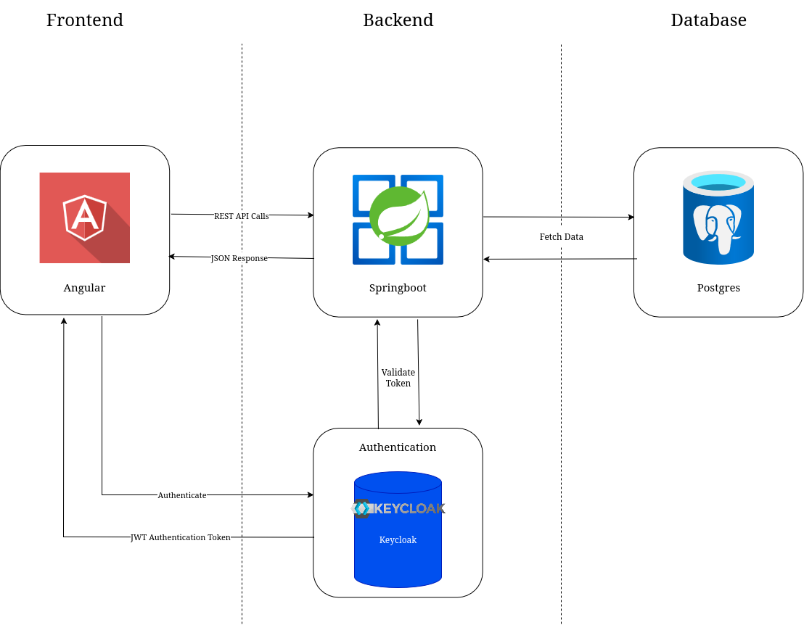

<b>Dokumentation Studyconnect</b>

<b>Gruppe 4</b>

### Architektur

  <em>Strukturdiagramm</em>

  Abbildung 1: Strukturdiagramm. <em>Erstellt mit <a href="https://draw.io">draw.io</a></em>

#### Angular (Frontend)

Angular bietet eine umfangreiche Sammlung integrierter Funktionalitäten wie Routing, Formularverarbeitung, HTTP-Client und State Management. Diese ermöglichen eine strukturierte und effiziente Entwicklung auch bei komplexen Anwendungen. Die klare Architektur sowie die strikte Trennung von Komponenten fördern sowohl die Wartbarkeit als auch die Skalierbarkeit des Systems.

Ein wesentlicher Vorteil liegt in der hohen Modularität: Durch wiederverwendbare Komponenten können dynamische Benutzeroberflächen einfacher und konsistenter entwickelt werden. Zusätzlich lässt sich Angular flexibel mit externen Bibliotheken und Abhängigkeiten erweitern, was den Funktionsumfang individuell anpassbar macht.

Angular wird aktiv von Google weiterentwickelt und als Open-Source-Projekt bereitgestellt. Dadurch profitieren Entwickler von einer kontinuierlichen Weiterentwicklung, einer umfangreichen Dokumentation und einer großen Community, die Hilfestellungen und Best Practices bereitstellt.

Ein weiterer Grund für die Wahl von Angular war die vorhandene Erfahrung im Team. Einige Mitglieder hatten bereits praktische Kenntnisse in Angular, was die Einarbeitungszeit deutlich reduziert.

##### Vorteile von TypeScript

Angular basiert auf TypeScript, einer von Microsoft entwickelten Erweiterung von JavaScript. TypeScript bietet statische Typisierung sowie moderne Sprachfeatures, die über den Standard von JavaScript hinausgehen. Dadurch wird eine höhere Codequalität erreicht, da viele Fehler bereits während der Entwicklungszeit erkannt werden. Das Debugging gestaltet sich dadurch effizienter, und die Wartung des Codes wird langfristig erleichtert.

TypeScript fördert zudem eine bessere Strukturierung von größeren Projekten. Dank Interfaces, Typdefinitionen und Klassenorientierung lassen sich komplexe Anwendungen übersichtlicher aufbauen und erweitern.

#### Spring Boot (Backend)

Für das Backend fiel die Wahl auf Spring Boot. Das Framework ermöglicht die schnelle und effiziente Entwicklung von REST-APIs, über die das Angular-Frontend mit den benötigten Daten versorgt wird.  

Die Architektur von Spring Boot ist klar strukturiert und folgt dem Schichtenmodell:  
- **Controller**: nimmt Anfragen entgegen und leitet sie weiter  
- **Service**: enthält die zentrale Geschäftslogik  
- **Repository**: kapselt den Zugriff auf die Datenbank  

Diese Trennung fördert eine saubere Code-Struktur und erleichtert die Wartung sowie Erweiterbarkeit der Anwendung.  

Spring Boot bietet zudem eine enge Integration mit Spring Data JPA, wodurch Datenbankzugriffe stark vereinfacht werden. Standard-CRUD-Operationen lassen sich ohne großen Implementierungsaufwand realisieren. Für komplexere Anforderungen können individuelle Methoden flexibel ergänzt werden.  

Ein weiterer Vorteil liegt in der großen Community und dem breiten Ökosystem von Spring. Dadurch stehen zahlreiche Erweiterungen und Bibliotheken zur Verfügung, die den Entwicklungsprozess beschleunigen und gleichzeitig die Stabilität der Anwendung sicherstellen.

#### PostgreSQL (Datenbank)

PostgreSQL hat sich als führender Open-Source-Konkurrent zu einem weit verbreiteten relationalen Datenbankmanagementsystem (DBMS) etabliert. 
Es bietet umfassende Funktionen wie die Unterstützung von JSON-Daten, Volltextsuche und benutzerdefinierten Datentypen. Zudem zeichnet es sich durch enorme Skalierbarkeit aus und ist sowohl für kleine als auch für sehr große Datenbanken geeignet. 
Durch die hohe ACID-Konformität gewährleistet es eine ausgezeichnete Datenintegrität und Transaktionssicherheit, während die engagierte Community kontinuierlich neue Funktionen und Updates bereitstellt.

### Projektmanagment

Für das Projektmanagement setzen wir auf das **GitHub-Kanban-Board**, auf dem alle Aufgaben, Features und sonstigen Angelegenheiten als Issues erfasst werden. Teammitglieder weisen sich Issues selbständig zu.

Die Entwicklung erfolgt auf *Feature-Branches*, die jeweils einem bestimmten Issue zugeordnet sind. Sobald ein Feature fertiggestellt ist, wird der Branch in `main` gemerged. Dabei wird in der Commit- oder Merge-Nachricht das zugehörige Issue verlinkt, sodass automatisch nachvollziehbar ist, welches Issue dadurch abgeschlossen wurde.

Die sonstige Kommunikation im Team läuft über einen Discord-Server, auf dem Rückfragen, Abstimmungen und Diskussionen zu Aufgaben stattfinden. So bleibt die Zusammenarbeit strukturiert, und alle Teammitglieder können jederzeit den aktuellen Stand einsehen.

